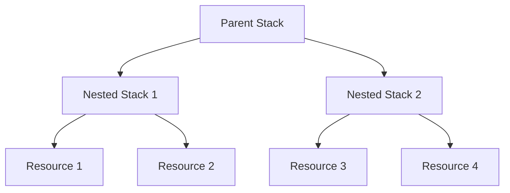

# CloudFormation Stack Policies

## Overview
CloudFormation Stack Policies are JSON documents that define the update actions that are allowed or denied on specific resources within a stack during stack updates.

## Key Points
- **Purpose**: Protect critical resources from unintended changes during stack updates.
- **Structure**: Defined in JSON format with `Statement` elements specifying `Effect`, `Action`, and `Principal`.
- **Effect**: Can be `Allow` or `Deny`.
- **Action**: Specifies the update actions (e.g., `Update:*`).
- **Resource**: Specifies the resources to which the policy applies.

## Example
```json
{
    "Statement": [
        {
            "Effect": "Deny",
            "Action": "Update:Replace",
            "Principal": "*",
            "Resource": "LogicalResourceId/MyCriticalResource"
        }
    ]
}
```

## Usage
- Apply stack policies during stack creation or update using the AWS Management Console, AWS CLI, or AWS SDKs.
- Modify stack policies to allow temporary updates and then revert to the original policy.

## Best Practices
- Regularly review and update stack policies to ensure they align with current security and operational requirements.
- Use descriptive logical IDs for resources to make policies easier to understand and manage.

For more details, refer to the [AWS CloudFormation Stack Policy Documentation](https://docs.aws.amazon.com/AWSCloudFormation/latest/UserGuide/protect-stack-resources.html).

Other links [Link](https://docs.aws.amazon.com/prescriptive-guidance/latest/least-privilege-cloudformation/cloudformation-stack-policies.html)


## CloudFormation Nested Stacks

## Overview
CloudFormation Nested Stacks allow you to manage related resources as a single unit. You can nest stacks within other stacks to create a hierarchy of stacks, which helps in organizing and reusing CloudFormation templates.

## Key Points
- **Purpose**: Simplify management of complex infrastructures by breaking them into smaller, reusable templates.
- **Structure**: A parent stack can include one or more child stacks, each defined by its own template.
- **Benefits**: Enhances modularity, reusability, and maintainability of CloudFormation templates.

## Example
### Parent Template
```json
{
    "Resources": {
        "MyNestedStack": {
            "Type": "AWS::CloudFormation::Stack",
            "Properties": {
                "TemplateURL": "https://s3.amazonaws.com/mybucket/my-nested-stack-template.json",
                "Parameters": {
                    "ParameterKey": "ParameterValue"
                }
            }
        }
    }
}
```

### Child Template
```json
{
    "Resources": {
        "MyResource": {
            "Type": "AWS::S3::Bucket",
            "Properties": {
                "BucketName": "my-nested-stack-bucket"
            }
        }
    }
}
```

## Usage
- Use nested stacks to encapsulate common patterns and components, making it easier to manage and update them.
- Reference nested stacks in the parent stack using the `AWS::CloudFormation::Stack` resource type.

## Best Practices
- Keep nested stack templates focused on a single responsibility to maximize reusability.
- Use versioning for nested stack templates to manage updates and rollbacks effectively.

## Diagram


For more details, refer to the [AWS CloudFormation Nested Stacks Documentation](https://docs.aws.amazon.com/AWSCloudFormation/latest/UserGuide/using-cfn-nested-stacks.html).


