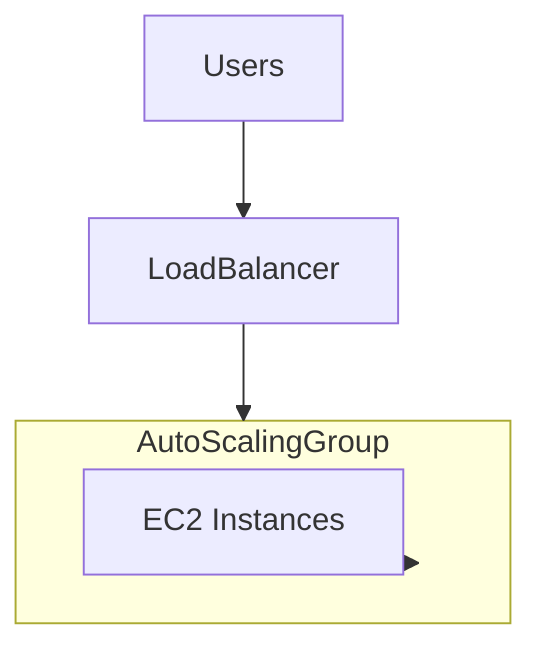

# Auto Scaling group
## Overview
An Auto Scaling group (ASG) is a collection of Amazon EC2 instances that are treated as a logical grouping for the purposes of automatic scaling and management.

## Key Concepts
- **Launch Configuration**: Template that an ASG uses to launch EC2 instances.
- **Scaling Policies**: Rules that define how to scale in or out.
- **Desired Capacity**: Number of instances the ASG should maintain.
- **Minimum/Maximum Size**: Limits on the number of instances in the ASG.

## Benefits
- **High Availability**: Automatically replaces unhealthy instances.
- **Cost Management**: Scales out during demand spikes and scales in during low demand.
- **Flexibility**: Easily adjust capacity based on demand.

## Common Use Cases
- **Web Applications**: Scale out to handle increased traffic.
- **Batch Processing**: Scale in after processing is complete.
- **Microservices**: Maintain desired number of instances for each service.

## Example
```yaml
Resources:
    MyAutoScalingGroup:
        Type: AWS::AutoScaling::AutoScalingGroup
        Properties:
            AutoScalingGroupName: my-asg
            LaunchConfigurationName: my-launch-config
            MinSize: 1
            MaxSize: 5
            DesiredCapacity: 3
            VPCZoneIdentifier:
                - subnet-12345678
                - subnet-87654321
            Tags:
                - Key: Name
                    Value: my-asg-instance
                    PropagateAtLaunch: true
```

## Types of Scaling Policies
- **Target Tracking Scaling**: Adjusts the number of instances to maintain a specified metric, such as CPU utilization.
- **Step Scaling**: Changes the number of instances in response to a set of scaling adjustments, based on the size of the alarm breach.
- **Simple Scaling**: Adds or removes instances based on a single scaling adjustment.
- **Scheduled Scaling**: Adjusts the number of instances based on a schedule, allowing you to plan scaling activities in advance.

## Capacity Settings
- **Desired Capacity**: The ideal number of instances you want running at any given time. This is the target capacity for your ASG.
- **Minimum Size**: The minimum number of instances that should be running in the ASG at all times. This ensures that your application always has a baseline level of capacity.
- **Maximum Size**: The maximum number of instances that the ASG can scale out to. This helps control costs and limits the number of instances to a manageable level.


## Flow Diagram

