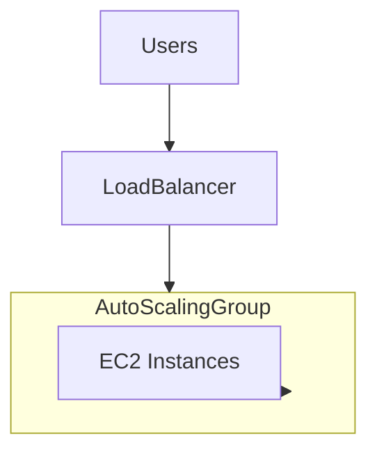

# Auto Scaling group
## Overview
An Auto Scaling group (ASG) is a collection of Amazon EC2 instances that are treated as a logical grouping for the purposes of automatic scaling and management.

## Key Concepts
- **Launch Configuration**: Template that an ASG uses to launch EC2 instances.
- **Scaling Policies**: Rules that define how to scale in or out.
- **Desired Capacity**: Number of instances the ASG should maintain.
- **Minimum/Maximum Size**: Limits on the number of instances in the ASG.

## Benefits
- **High Availability**: Automatically replaces unhealthy instances.
- **Cost Management**: Scales out during demand spikes and scales in during low demand.
- **Flexibility**: Easily adjust capacity based on demand.

## Common Use Cases
- **Web Applications**: Scale out to handle increased traffic.
- **Batch Processing**: Scale in after processing is complete.
- **Microservices**: Maintain desired number of instances for each service.

## Example
```yaml
Resources:
    MyAutoScalingGroup:
        Type: AWS::AutoScaling::AutoScalingGroup
        Properties:
            AutoScalingGroupName: my-asg
            LaunchConfigurationName: my-launch-config
            MinSize: 1
            MaxSize: 5
            DesiredCapacity: 3
            VPCZoneIdentifier:
                - subnet-12345678
                - subnet-87654321
            Tags:
                - Key: Name
                    Value: my-asg-instance
                    PropagateAtLaunch: true
```

## Types of Scaling Policies
- **Target Tracking Scaling**: Adjusts the number of instances to maintain a specified metric, such as CPU utilization.
- **Step Scaling**: Changes the number of instances in response to a set of scaling adjustments, based on the size of the alarm breach.
- **Simple Scaling**: Adds or removes instances based on a single scaling adjustment.
- **Scheduled Scaling**: Adjusts the number of instances based on a schedule, allowing you to plan scaling activities in advance.

## Capacity Settings
- **Desired Capacity**: The ideal number of instances you want running at any given time. This is the target capacity for your ASG.
- **Minimum Size**: The minimum number of instances that should be running in the ASG at all times. This ensures that your application always has a baseline level of capacity.
- **Maximum Size**: The maximum number of instances that the ASG can scale out to. This helps control costs and limits the number of instances to a manageable level.


## Flow Diagram



## AWS CLI Command for Simple Scaling

To create a simple scaling policy using AWS CLI with `--adjustment-type PercentageChangeInCapacity`, you can use the following command:

```sh
aws autoscaling put-scaling-policy \
    --auto-scaling-group-name my-asg \
    --policy-name my-simple-scaling-policy \
    --scaling-adjustment 20 \
    --adjustment-type PercentageChangeInCapacity
    # --adjustment-type ChangeInCapacity
    # --adjustment-type ExactCapacity
    
```

This command creates a scaling policy named `my-simple-scaling-policy` for the Auto Scaling group `my-asg`, which increases the number of instances by 20% when triggered.


## AWS CLI Command for Step Scaling

Step scaling policies increase or decrease the number of instances in response to a set of scaling adjustments, based on the size of the alarm breach. This allows for more granular control over scaling actions.

To create a step scaling policy using AWS CLI, you need to first create CloudWatch alarms and then create the scaling policy.

### Step 1: Create CloudWatch Alarms

```sh
aws cloudwatch put-metric-alarm \
    --alarm-name cpu-high \
    --metric-name CPUUtilization \
    --namespace AWS/EC2 \
    --statistic Average \
    --period 300 \
    --threshold 70 \
    --comparison-operator GreaterThanThreshold \
    --dimensions Name=AutoScalingGroupName,Value=my-asg \
    --evaluation-periods 2 \
    --alarm-actions arn:aws:autoscaling:region:account-id:scalingPolicy:policy-id:autoScalingGroupName/my-asg:policyName/my-step-scaling-policy

aws cloudwatch put-metric-alarm \
    --alarm-name cpu-low \
    --metric-name CPUUtilization \
    --namespace AWS/EC2 \
    --statistic Average \
    --period 300 \
    --threshold 30 \
    --comparison-operator LessThanThreshold \
    --dimensions Name=AutoScalingGroupName,Value=my-asg \
    --evaluation-periods 2 \
    --alarm-actions arn:aws:autoscaling:region:account-id:scalingPolicy:policy-id:autoScalingGroupName/my-asg:policyName/my-step-scaling-policy
```

### Step 2: Create Step Scaling Policy

```sh
aws autoscaling put-scaling-policy \
    --auto-scaling-group-name my-asg \
    --policy-name my-step-scaling-policy \
    --policy-type StepScaling \
    --adjustment-type ChangeInCapacity \
    --step-adjustments "MetricIntervalLowerBound=0,MetricIntervalUpperBound=10,ScalingAdjustment=1" \
    --step-adjustments "MetricIntervalLowerBound=10,ScalingAdjustment=2" \
    --estimated-instance-warmup 300
```

This command creates a step scaling policy named `my-step-scaling-policy` for the Auto Scaling group `my-asg`, which adjusts the number of instances based on the specified step adjustments.

## Termination Policies

Termination policies determine which instances are terminated first when scaling in. AWS provides several predefined termination policies to help manage this process:

- **Default**: The default termination policy follows these steps:
    1. Select instances in the Availability Zone with the most instances.
    2. Select instances that are not protected from scale-in.
    3. Select instances with the oldest launch configuration.
    4. Select instances closest to the next billing hour.
    5. Randomly select an instance if there are multiple candidates.

- **OldestInstance**: Terminates the oldest instance in the group.
- **NewestInstance**: Terminates the newest instance in the group.
- **OldestLaunchConfiguration**: Terminates instances with the oldest launch configuration.
- **ClosestToNextInstanceHour**: Terminates instances that are closest to the next billing hour.

You can also create custom termination policies by combining these predefined policies to suit your specific needs.

## AWS Provided Predefined Policies

AWS provides several predefined scaling policies to simplify the process of configuring Auto Scaling groups:

- **Target Tracking Scaling**: Adjusts the number of instances to maintain a specified metric, such as average CPU utilization or request count per target.
- **Step Scaling**: Changes the number of instances in response to a set of scaling adjustments, based on the size of the alarm breach.
- **Simple Scaling**: Adds or removes instances based on a single scaling adjustment.
- **Scheduled Scaling**: Adjusts the number of instances based on a schedule, allowing you to plan scaling activities in advance.

These predefined policies help you quickly set up scaling rules that match common use cases and best practices.


## Instance Refresh

An Auto Scaling Group (ASG) Instance Refresh is a feature provided by AWS that allows you to update the instances in your Auto Scaling group in a controlled and automated manner. This is particularly useful when you need to apply updates, such as new application versions, configuration changes, or security patches, to your instances without causing downtime or disruption to your application.

Key Concepts of ASG Instance Refresh:
Rolling Updates: Instance Refresh performs updates in a rolling manner, meaning it updates a subset of instances at a time. This helps maintain application availability during the update process.

Health Checks: During the refresh process, ASG performs health checks to ensure that new instances are healthy before terminating the old ones. This ensures that only healthy instances are part of the ASG.

Minimum Healthy Percentage: You can specify the minimum percentage of healthy instances that must be maintained during the refresh process. This ensures that a certain level of capacity is always available.

Pause and Resume: The refresh process can be paused and resumed, giving you control over the update process.

Rollback: If the refresh process encounters issues, you can roll back to the previous state to ensure stability.

Example of Initiating an Instance Refresh:
You can initiate an instance refresh using the AWS Management Console, AWS CLI, or AWS SDKs. Here is an example using the AWS CLI:

In this example, my-asg is the name of your Auto Scaling group, and the MinHealthyPercentage is set to 90%, meaning at least 90% of the instances must be healthy during the refresh process.

Benefits of ASG Instance Refresh:
Automated Updates: Simplifies the process of updating instances by automating the replacement of old instances with new ones.
Reduced Downtime: Maintains application availability by performing updates in a rolling manner.
Improved Reliability: Ensures that only healthy instances are part of the ASG, improving the overall reliability of your application.
By using ASG Instance Refresh, you can ensure that your application remains up-to-date and secure while minimizing the risk of downtime and disruption.

## Warm pools
Warm pools are a feature of Auto Scaling groups that allow you to pre-warm instances before they are needed for scaling. This helps reduce the time it takes to launch new instances during scale-out events.

### Key Points
- **Pre-Warmed Instances**: Instances are launched and initialized in advance, so they are ready to handle traffic immediately when needed.
- **Reduced Latency**: Minimizes the delay associated with launching and initializing new instances during scaling events.
- **Cost Management**: You can manage costs by controlling the number of pre-warmed instances and their lifecycle.

### Benefits
- **Faster Scaling**: Instances are already running and can be added to the ASG quickly.
- **Improved Performance**: Reduces the time to respond to traffic spikes, improving application performance.

### Example
To create a warm pool using AWS CLI:
```sh
aws autoscaling create-warm-pool \
    --auto-scaling-group-name my-asg \
    --pool-state Stopped \
    --min-size 2
```
This command creates a warm pool with a minimum of 2 stopped instances for the Auto Scaling group `my-asg`.

## Entering Instances into Standby

You can place instances in an Auto Scaling group into standby mode to perform maintenance or troubleshooting without terminating them. Instances in standby mode are still part of the Auto Scaling group but do not actively handle traffic.

### Key Points
- **Maintenance**: Allows you to perform updates or maintenance on instances without affecting the overall capacity of the Auto Scaling group.
- **Troubleshooting**: Useful for diagnosing issues on specific instances without removing them from the group.

### AWS CLI Command
To enter an instance into standby mode using AWS CLI, use the following command:

```sh
aws autoscaling enter-standby \
    --instance-ids i-1234567890abcdef0 \
    --auto-scaling-group-name my-asg \
    --should-decrement-desired-capacity
```

This command places the instance with ID `i-1234567890abcdef0` into standby mode in the Auto Scaling group `my-asg`. The `--should-decrement-desired-capacity` flag indicates whether the desired capacity of the group should be decremented when the instance is placed into standby.


## AWS CLI Command to Describe Scaling Activities

To describe the scaling activities for an Auto Scaling group using AWS CLI, you can use the following command:

```sh
aws autoscaling describe-scaling-activities \
    --auto-scaling-group-name my-asg
```

### Explanation
This command retrieves information about the scaling activities that have occurred for the specified Auto Scaling group (`my-asg`). The output includes details such as the activity status, start and end times, and any associated error messages. This information can help you understand the scaling events and troubleshoot any issues related to scaling activities.