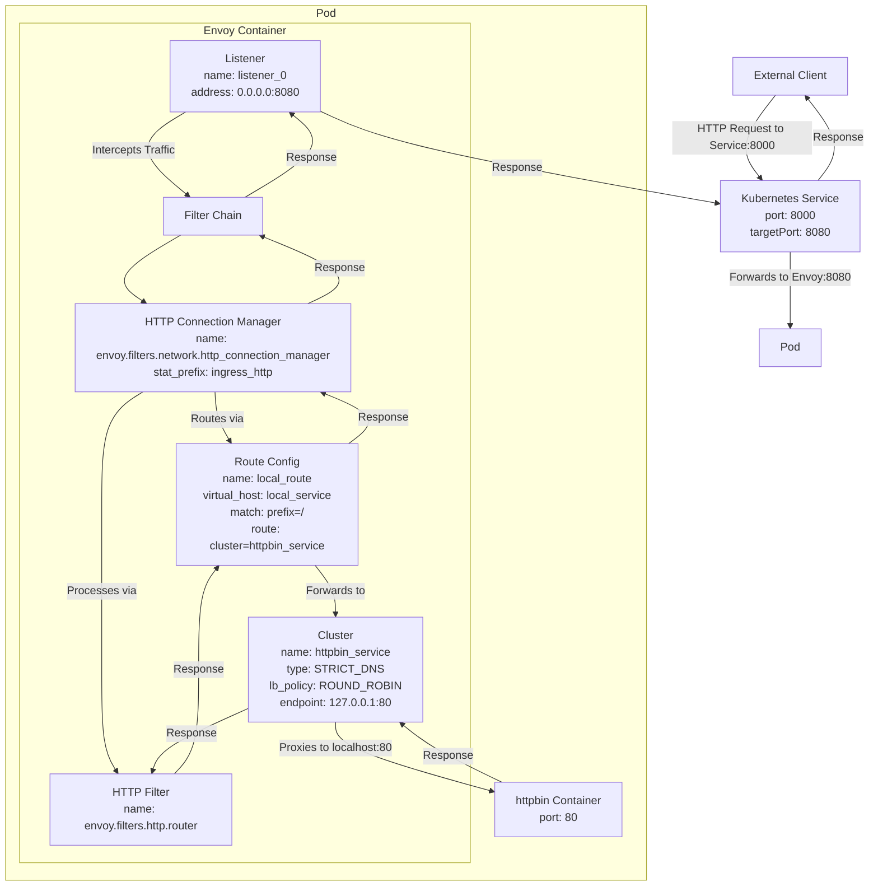
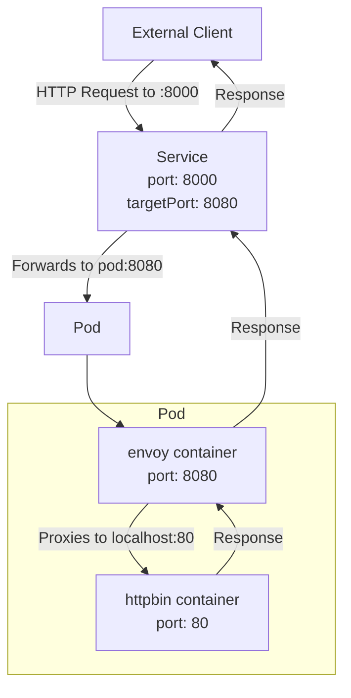

1. Create a configmap for envoy configurations - envoy-configmap.yaml

```
apiVersion: v1
kind: ConfigMap
metadata:
  name: httpbin-envoy-config
data:
  envoy.yaml: |
    static_resources:
      listeners:
      - name: listener_0
        address:
          socket_address: { address: 0.0.0.0, port_value: 8080 }
        filter_chains:
        - filters:
          - name: envoy.filters.network.http_connection_manager
            typed_config:
              "@type": type.googleapis.com/envoy.extensions.filters.network.http_connection_manager.v3.HttpConnectionManager
              stat_prefix: ingress_http
              route_config:
                name: local_route
                virtual_hosts:
                - name: local_service
                  domains: ["*"]
                  routes:
                  - match: { prefix: "/" }
                    route: { cluster: httpbin_service }
              http_filters:
              - name: envoy.filters.http.router
                typed_config:
                  "@type": type.googleapis.com/envoy.extensions.filters.http.router.v3.Router
      clusters:
      - name: httpbin_service
        connect_timeout: 0.25s
        type: STRICT_DNS
        lb_policy: ROUND_ROBIN
        load_assignment:
          cluster_name: httpbin_service
          endpoints:
          - lb_endpoints:
            - endpoint:
                address:
                  socket_address:
                    address: 127.0.0.1
                    port_value: 80

```




### Create a deployment

2. deployment.yaml
   
```
apiVersion: apps/v1
kind: Deployment
metadata:
  name: httpbin
spec:
  replicas: 1
  selector:
    matchLabels:
      app: httpbin
      version: v1
  template:
    metadata:
      labels:
        app: httpbin
        version: v1
    spec:
      containers:
      - name: httpbin
        image: kennethreitz/httpbin
        ports:
        - containerPort: 80
      - name: envoy
        image: envoyproxy/envoy:v1.28.0 # Using a specific stable version
        args:
        - "envoy"
        - "-c"
        - "/etc/envoy/envoy.yaml"
        ports:
        - containerPort: 8080
        volumeMounts:
        - name: envoy-config-volume
          mountPath: /etc/envoy
      volumes:
      - name: envoy-config-volume
        configMap:
          name: httpbin-envoy-config

---

apiVersion: v1
kind: Service
metadata:
  name: httpbin
spec:
  ports:
  - port: 8000
    targetPort: 8080
    protocol: TCP
    name: http
  selector:
    app: httpbin

```

3. Test it by creating the pod inside `kubectl run client --rm -it --image=curlimages/curl -- sh`

```
curl http://httpbin:8000/headers
```


Overall architecture and traffic flow



